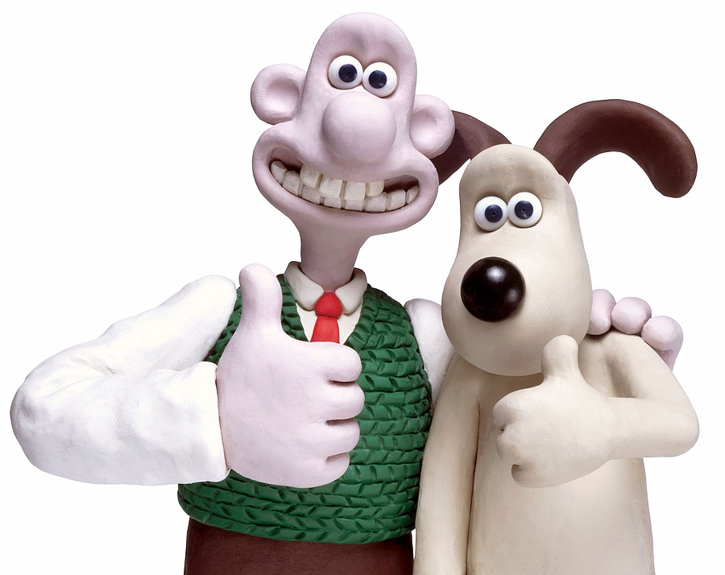

= Einleitung

== Motivation

Es war nicht einfach ein für mich passendes Thema für meine Maturitätsarbeit zu finden.
In den ersten Jahren des Gymnasiums war ich mir immer sicher, dass ich meine Abschlussarbeit im Fachbereich _Bildnerisches Gestalten_ machen werde.
Mit den Jahren wurde ich aber immer unsicherer, ob das die richtige Entscheidung sei, denn der Anspruch an künstlerischem Ausdruck im Bildnerischen Gestalten wurde laufend höher.
Schlussendlich habe ich mich dazu entschieden, die Maturitätsarbeit als ein Gefäss für etwas Neues zu nutzen und mich an ein mir komplett unbekanntes Feld heranzuwagen.

Ich habe zwei Leidenschaften verbunden, die mich seit der Kindheit begleiten.
Auf der einen Seite habe ich bereits im Kindergarten sehr gerne gebastelt und modeliert.
Auf der anderen Seite sah ich mir gerne animierte Filme an.
Der erste Film, den ich im Kino gesehen habe, war _Wallace & Gromit_. Dieser war nicht nur animiert, sondern setzte den "Claymationfilm" in Perfektion um. _Claymation_ ist ein Porte-Manteau Wort, aus den Englischen Wörtern "clay", zu Deutsch "Lehm" und "animation". Claymation beschreibt eine Methode der Filmanimation, bei welcher man mit modelierbaren Tonfiguren arbeitet und diese mit der Stop-Motion-Technik fotografiert. _Stop-Motion_ ist eine Filmtechnik, bei der eine Illusion von Bewegung erzeugt wird, indem man einzelne Standbilder aneinanderreiht.

.Wallace und Gromit

Doch die eigentliche Inspiration für meine Maturitätsarbeit fand ich im Gymnasium, in einer Französisch Lektion, kurz vor den Sportferien 2017.
Zum Abschluss des Semesters sahen wir uns im Unterricht den Stop-Motion Film von _Claude Barras_, "_Ma vie de courgette_" an.
Ich war begeistert von der Fähigkeit des Künstlers, eine solch tragische, tief traurige Geschichte so lebhaft und einfühlsam zu vermitteln.
Die vorliegende Arbeit verbindet deshalb meine Interessen an künstlerischem  Arbeiten und der Liebe zum animierten Film.

Durch äussere Einflüsse, wie zum Beispiel die Schönheitsideale im _Bravo Magazin_ oder das Körperbild, welches in _Germanys Next Topmodel_ publiziert wird, bin ich seit früh damit konfrontiert gewesen, ob und wie ich mit meinem Körper zufrieden bin.
Während ich anfangs Primarschule noch mit meiner Figur zufrieden war, hat sich mein Körpergefühl über die Jahre stark verändert.
Die Ansprüche, die die heutige Zeit und mit ihr die moderne Gesellschaft, stellen, führten dazu, dass ich einem Ideal entsprechen wollte und deshalb bis heute mit meiner Figur unzufrieden bin.
Dabei ist es so, dass ich kognitiv weiss, dass ich diesen Idealen nicht entsprechen müsste, es mir aber schwer fällt, diesem impliziten Druck von Aussen nicht nachzugeben.
Weil mich dieses Thema seit vielen Jahren beschäftigt und ich der Meinung bin, dass sich Jugendliche anfangs ihrer Pubertät nicht diesen Zwängen unterordnen sollen, habe ich mich entschieden, als Inhalt meiner Maturitätsarbeit das Thema "Körperbewusstsein" zu bearbeiten.

== Fragestellung und Ziel

Wenn man sich einen _Stop-Motion_ Film, wie den oben erwähnten _Wallace & Gromit_ oder _Pingu_ anschaut, hat man zwar intuitiv eine Ahnung davon, dass hinter einem solchen Werk ein grosser Aufwand steht.
Es war mir aber nicht klar, wie gross dieser Aufwand tatsächlich ist und welche weiteren Techniken man verwenden muss, um einen Animationsfilm zu erstellen.

Ich bin davon ausgegangen, dass ich mich vor allem mit dem Thema _Animation_ und _Stop-Motion_ beschäftigen müsse.
Während der Arbeit stellte ich fest, dass ein Film noch viele weitere Aspekte wie _Dramaturgie_, _Claymation_, _Fotographie_, _Beleuchtung_, _Ton_ und _Schnitt_ enthält, in die ich mich erstmals ernsthaft einarbeiten musste.

Ziel meiner Arbeit ist es, einen mit simpeln gestalterischen Mittel entworfenen _Stop-Motion_ Kurzfilm zum Thema _Körpernorm und Körperwahn_, von etwa zwei Minuten Dauer, zu drehen.
Die Hauptfigur soll sowohl in Materialisierung und Form so einfach wie möglich gestaltet sein und aus einem knetbaren Material bestehen.
Durch das Aufzeigen von Gefühlen, die durch die alltägliche Handlungen aufkommen und durch die gestalterische Abstrahierung der Figuren soll der Zuschauer Parallelen zu eigenen bekannten Ereignissen oder Gefühlen ziehen und die Handlung selbst interpretieren und deuten können.

Aufgrund dieses Zieles musste ich mir erstens erarbeiten, wie ich einen Film animieren und eine Geschichte erzählen kann.
Zweitens musste ich mir für die Entwicklung meiner Figur überlegen, wie ich mit einfachen Mitteln Emotionen, Verhalten, Gedanken und Botschaften ausdrücken kann. Drittens wollte ich mich mit dem Material befassen, um es möglichst variantenreich und für meinen Inhalt optimal einzusetzen.
