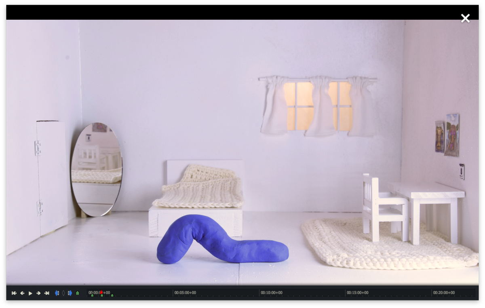
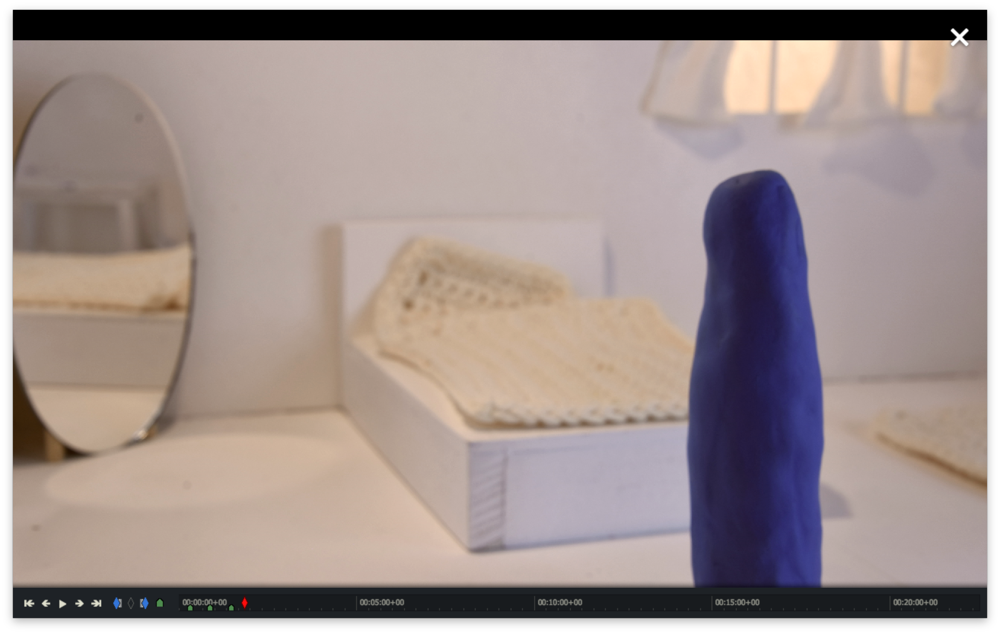
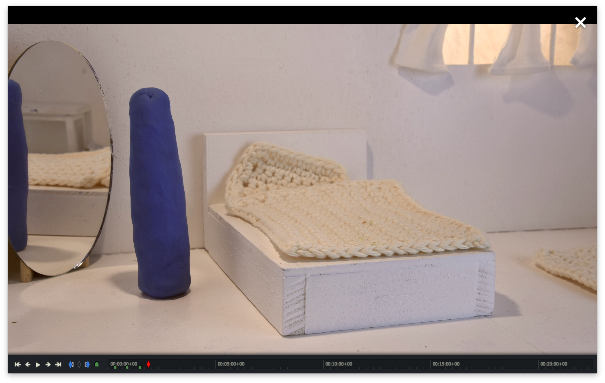
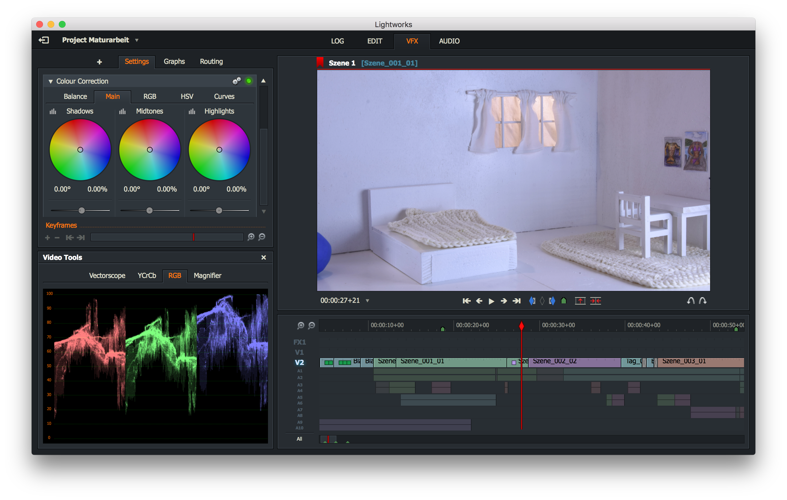
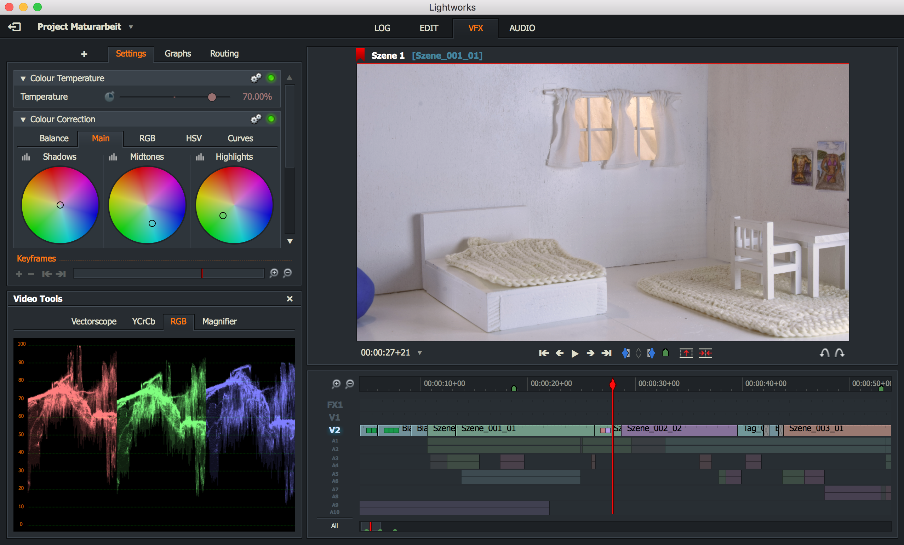

= Material und Methode

Ich teile dieses Kapitel in drei Themen ein, wie sie auch bei einer richtigen Filmproduktion stattfinden.
In der _Preproduction_ werden die Vorbereitungen für den Dreh gemacht.
Dazu gehören Drehbuch, Material, Technik und anders.

== Preproduction

=== Idee und Drehbuch

Wie in der Einleitung erwähnt, war es mir anfänglich sehr wichtig eine Arbeit mit einer Aussage zu machen.
Das behandelte Thema liegt oft in den Mündern der Leute, des öfteren wird es leider nicht ernstgenommen.
Weil es mir persönlich aber sehr wichtig ist ein ernstzunehmends Produkt herzustellten, war es wichtig meine Ideen gut umzusetzen und gegen Aussen verständlich zu machen.
Dafür brauchte ich ein Drehbuch.
Noch nie hatte ich zuvor ein Drehbuch geschrieben oder angeschaut, deshalb wusste ich nicht wirklich was ich machen soll.
In meinem Skizzenbuch habe ich meine Ideen aufgeschrieben und aufgezeichnet.
Durch diesen Prozess kam ich zu einer klareren Vorstellung des Ablaufs meiner Geschichte.
Jedoch habe ich erstlich eine zu komplexe Idee.
Ich wollte mehrere Schauplätze herstellten und dadurch verschiedene Handelstränge einleiten.
Nach den ersten Filmsequenzen habe ich aber gemerkt, wie viel Arbeit es wirklich braucht.
Deshalb habe ich mich ziemlich schnell an der ersten Idee festgehalten und diese soweit ausgebaut, wie es mir möglich war.

.Anfängliche Idee
image::images/drehbuch_ideen.png[Drehbuch Ideen, pdfwidth=67%,align=center]

=== Storyboard

Wie in jedem Film, vor allem in animierten Filmen, braucht man für die konkrete Umsetzung von einer Idee zu einem Film ein Storyboard.
Man skizziert auf ein Blatt Papier grob eine Kameraeinstellung.
Das heisst die Perspektive, was auf dem Bildausschnitt zu sehen ist und beschreibt die Handlung in einem kurzen Satz.
Somit kann man auch verschiedene Handlungen aufzeichnen und dann vor sich haben und umpositionieren, bis man einen ganzen Handlungsstrang hat.
Das Storyboard hilft schlussendlich bei der Positionierung der Kamera.
Und es vermeidet eine langweilige Kameraführung.

.Storyboard
image::images/storyboard.png[Storyboard, pdfwidth=100%,align=center]

.Endgültige Kalenderszene
image::images/KalenderSS.png[Aufegenommene Kalenderszene, pdfwidth=67%,align=center]

.Endgültige Szene mit Wurm Bewegung

.Endgültige Spiegelszene
image::images/SpiegelKugelSSpng[Endgültige Spiegelszene, pdfwidth=67%,align=center]

=== Knetmasse

Um mich an die Arbeit heranzutasten, habe ich mich zuerst mit verschiedenen Modeliermassen auseinander gesetzt.
In allen Bastelläden, die ich besucht habe, wurde mir das Material _((Fimo))_ vorgeschlagen.
Bei der Arbeit damit stellte sich aber heraus, dass dieses Material sehr schnell brüchig und hart wird.
Dementsprechend war es für meine Arbeit nicht geeignet.

_((Plastilin))_ erwies sich schlussendlich als das passendste Material.
Um mich daran zu gewöhnen habe ich eine Zeit lang oft damit modelliert und verschiedene Objekte nachgebildet, um zu sehen was man mit Plastilin gestalten kann.
Es wurde mir schnell klar, dass Plastilin für vieles sehr passend ist.
Es lassen sich sowohl einfarbige, als auch mehrfarbige sowie gemischte Objekte herstellen.
Von dick zu dünn ist ziemlich alles möglich.
Ich habe Versuche gemacht, bei denen ich mich darauf geachtet habe verschiedene Oberflächen Strukturen nach zu bilden.
Einen Nachteil hat das Material aber auch.
Es ist nicht sehr stabil, es reissen also dünne Teile eines Objektes ab oder knicken sehr schnell ein.
Schwierigkeit, dass das Material fest ist aber durchlässig wirkern soll.
Die Standhaftigkeit eines Objektes ist sehr wichtig und somit ein wenig einschränkend, denn man muss für die Standfestigkeit immer einen breiten unteren Teil haben.

.Erdnuss Nachbildung
image::images/Erdnuss2.jpg[Erdnuss Nachbildung, pdfwidth=33%,align=center]

.Feuer Nachbildung
image::images/Feuer.jpg[Feuer Nachbildung, pdfwidth=33%,align=center]

=== Software

Weil es zu zeitaufwenig und ungenauer wäre einzelne Fotos zu schiessen und dann manuell in nacheinander abspielen zu lassen, habe ich recherchiert, um herauszufinden wie ich am besten meine Arbeit filmen kann. Ich habe verschiedene Möglichkeiten ausprobiert und miteinander verglichen.
Die erste Technik, die ich angewendet habe war das heruntergeladene App "_StopMotion Studio_" auf meinem iPhone, welches man auf ein extra für Smartphones konstruiertes Stativ montiert.
Dies erwies sich jedoch als nicht sehr geeignet, denn die Qualität des Filmes war nicht sehr überzeugend und unpraktisch zu bedienen, denn das iPhone auf dem Stativ war nicht sehr standhaft "stabil".
Beim Bedienen des Auslösers muss man den Bildschirm berühren.
Dabei hat sich das ganze Stativ ein wenig verschoben und das resultierende Video wurde wackelig.

Danach habe ich auf dem Internet nach weiteren Stop-Motion Programmen recherchiert.
Zuerst wollte ich nur ein günstiges Programm suchen und entschied ich mich für "_IStopMotion_".
Nachdem ich das Programm gekauft hatte, stellte ich fest, dass es nicht mit mit meiner Kamera zusammen funktionierte.
deshalb musste ich auch bei diesem Programm wieder für mein Smartphone entscheiden.
Ich musste deshalb auch wieder mit dem Smartphone arbeiten, was ebenfalls die oben erwähnten Probleme hatte..

"_IStopMotion_" war aber auch sonst eine grosse Enttäuschung, denn es stürzte ständig ab.
Dadurch verlor ich einige Male gefilmte Sequenzen.
Zusätlich gab es keine Funktion zum manuellen scharfstellen was die Bildgestaltung sehr erschwerte.

Nach weiteren Recherchen bin ich dann auf das professionelle Animationsprogramm "((_Dragonframe_))" gestossen.
Ich habe die Testversion auf meinen Computer geladen und eine dazu passende Kamera, eine "((Nikon D7200))" von einer Familienfreundin organisiert.
Mit der Testversion habe ich kurze Ausschnitte gefilmt und das komplizierte Programm erlernt.
Da die Resultate endlich überzeugend waren und alles funktionierte, entschied ich mich dass ich lieber Geld in ein gut funktionierendes Programm investieren möchte, als weitere Zeit zu verlieren.
Deshalb kaufte ich mir die Software und die dazu passende Steuerkonsole.

=== Bühnenbau

Ich habe einen Puppenhaus artigen Grundriss mit Boden konstruiert.
Ich habe meine Ideen umgesetzt und ein Häuschen aus Sperrholz zusammengebaut.
Ich habe mich für den Bau eines Schlafzimmers entschieden, damit ich einen einheitlichen Raum zur Verfügung habe, der nicht nach jedem Filmprozess neu gestaltet oder umgebaut werden muss.
Das Puppenhaus ähnliche Schlafzimmer hat sich als sehr praktisch herausgestellt, denn ich konnte das ganze Zimmer verschieben und somit Perspektiven erzeugen, die allein mit der Verschiebung der Kamera nicht machbar gewesen wären.
Ausgestattet habe ich diesen Raum mit selber gemachten Möbeln und Dekorationen.

.Bühnebau
image::images/szenenbau.png[Szenenbau Skizze,pdfwidth=67%,align=center]

== Production

=== Beleuchtung

Bei der Beleuchtung der Szene habe ich mich ziemlich eingegrenzt.
Ich habe mich auf eine Filmgrundlage basiert.
Die Dreipunkt Beleuchtung benutzt man oft, um eine ganze Szene zu beleuchten und verschiedene Teile zu fokusieren.

.Beleuchtung
image::images/beleuchtung.png[Beleuchtung,pdfwidth=67%,align=center]

=== Film und Fotografie

Dank Barabara Burri, einer Bekannten, war es mir möglich mit einer professionellen Spiegelreflex Kamera, einer Nikon D7200 und einem xy Objektiv arbeiten zu können.
Die Qualität meines Filmes ist auf diese Kamera zurück zu führen.
Ausserdem hat die Kamera es mir ermöglicht mit einem professionellem, auf Animationen spezialisiertem Programm zu arbeiten.
Gemäss Hurni <<hurni>> ist es bei der Bildkomposition wichtig, die Drittelregel anzuwenden.
Dabei wird das Bild mit vier Linien (zwei Horizontalen und zwei Vertikalen) in neun gliechgrosse Rechtecke unterteilt.
Die Schnittpunkte der Linien benutzt man um das Motiv zu positionieren.
Man versucht das Motiv auf einen der Schnittpunkte zu platzieren.
Dies gefällt dem Menschlichen Auge, vermutlich weil die vier Schnittpunkte von den Proportionen her, dem Goldenen Schnitt ähneln.

Durch das Verwenden des Teleobjektiv war es mir möglich sowohl Nahaufnahmen, als auch die Totale zu verwenden, um unterschiedliche Bildausschnitte zu zeigen.

Mit der Tiefenschärfe kann man im Film die Aufmerksamkeit des Betrachters leiten.
Ich habe in meinem Film bewusst versucht dieses Mittel der Gestaltung zu nutzen.
In der untern gezeigten Szene kann man sehen, wie sich Schärfe verändert während die Figur den Raum betretet.
Angekommen beim Spiegel, am eigentlichen Ort der Handlung, ist die Kamera so eingestellt, dass das Spiegelbild scharf ist und somit die Bewegungen der Figur gut erkennbar sind.

.Tiefenschärfe 1

.Tiefenschärfe 2

=== Ton

Gleichzeitig habe ich mit einem "((Zoom H5))"-Fieldrecorder Geräusche in meinem Haus aufgenommen, die passend zu den aufgenommenen Szenen waren.
Viele der Geräusche habe ich aus ähnlichen Tätigkeiten, wie die im Film gezeigten, aufgenommen, um es so wahrheitsgetreu wie möglich zu darstellen.
Beispielsweise habe ich für das Abreissen des Kalender ein normales Kopierpapier zerissen oder für den Ton der schliessenden Türe, habe ich das quietschen meiner Kleiderschranktüre aufgenommen.
Es war ein interessanter und kreativer Prozess, diese einzelnen Szenen zu vertonen.
Diese einzelnen habe ich als Clips in "Lightworks" importiert und an passender Stelle platziert.
Hier und Da mussten gewisse Tonaufnahmen bearbeitet oder gekürzt werden.
Weil ich die Videoaufnahmen jeweils mit 50% Schnelligkeit im Schnittprogramm laufen liess, konnte ich erst nach der Verlangsamung die jeweilig passende Tonspur aufnehmen.
Ansonsten hätte sich bei der nachträglichen Bearbeitung die Tonspur in ihrer Tonhöhe unterschieden.

== Postproduction

Nach dem die etwa 3000 Fotos auf Festplatte gebannt sind, geht es im folgenden Schritt darum, aus diesem Rohmaterial einen Film zu machen.
Am Anfang dachte ich, dass es sich dabei nur um das Schneiden von Filmsequenzen handelt, aber es sind noch weitere Schritte nötig, um ein fertiges Produkt erhalten.

=== Schnitt

Nach dem fotografieren einer Szene habe ich die noch einzelnen Fotos als Video exportiert und in das Schnittprogramm _(((Lightworks)))_ eingefügt.
Dort habe ich stetig die Sequenzen hintereinander eingefügt und erhielt somit einen Groben Verlaufsstrang.
Weiter hinzu kamen die Übergänge.
Mir persönlich gefallen die Überblendungen am besten.
Sie scheinen für mich am simpelsten und am natürlichsten fürs Auge.
Den Vorspann und Abspann habe ich direkt in Lightworks in den vorhandenen Film eingefügt und mit verschiedenen Effekten bearbeitet.

.Zeitachse in Lightworks
image::images/Spuren.lwks.png[Zeitachse in Lightworks, pdfwidth=100%,align=center]

=== Farbkorrektur

Ganz am Schluss meiner Arbeit musste ich noch die Farben im Film anpassen, weil die Unterschiede der verschiedenen Lichtereignissen zu gross waren.
TODO: Farbtemperatur
Nach Recherche und Versuchen habe ich selber herausgefunden, wie man die Farben im "Lightworks" korrigieren kann.
Diese Arbeit ist nicht sehr einfach und basiert auf dem indivuduellen Auge und Geschmack.
Ich habe im allgemeinen versucht mein Film wärmer zu kolorieren, denn die orignalen Aufnahmen hatten einen starken Blaustich.
Ausserdem habe ich versucht, die Veränderungen von beispielsweise der Morgenszene und der darauf folgenden Szene zu minimieren.

.Originale Aufnahme

.Kolorierte Aufnahme

=== Musik

Die Musik, die ich für meinen Vorspann und Abspann gewählt habe, habe ich aus einer xy Webseite für Lizenzfreie Musik genommen.
Mir war es wichtig durch die Musik ein Spannungsgefüge aufzubauen.
Zu Beginn scheint die Gitarrenbegleitung eher einfach und simpel und gegen Ende wird sie dann aufregender und scheint glücklicher.
