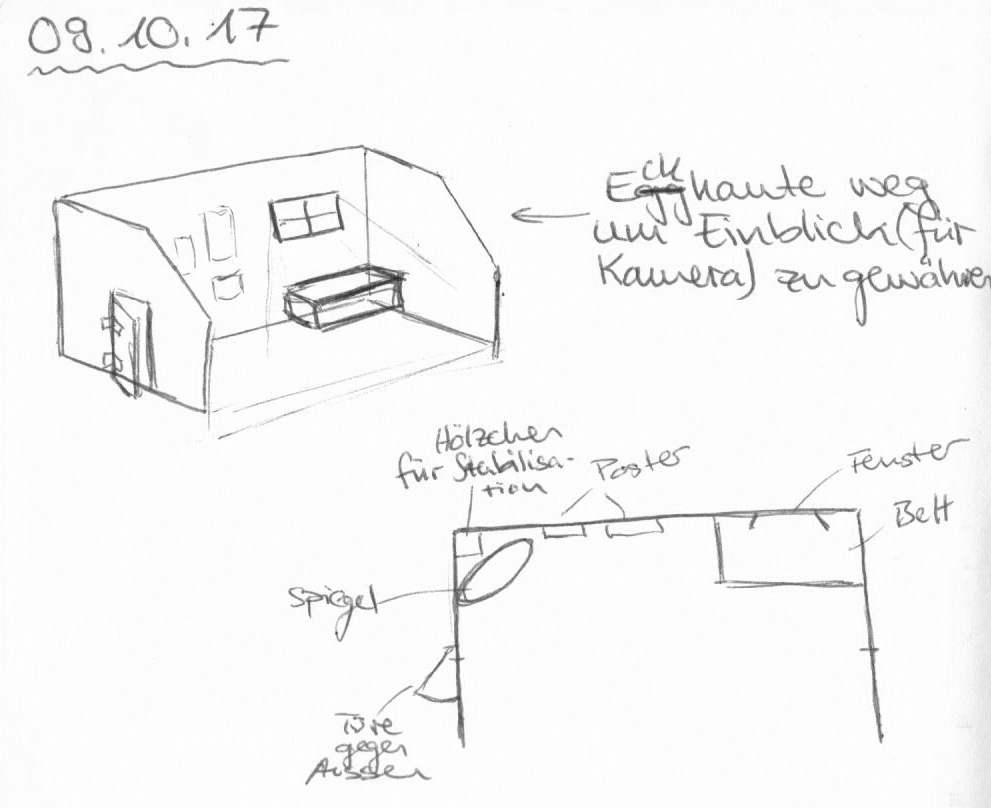
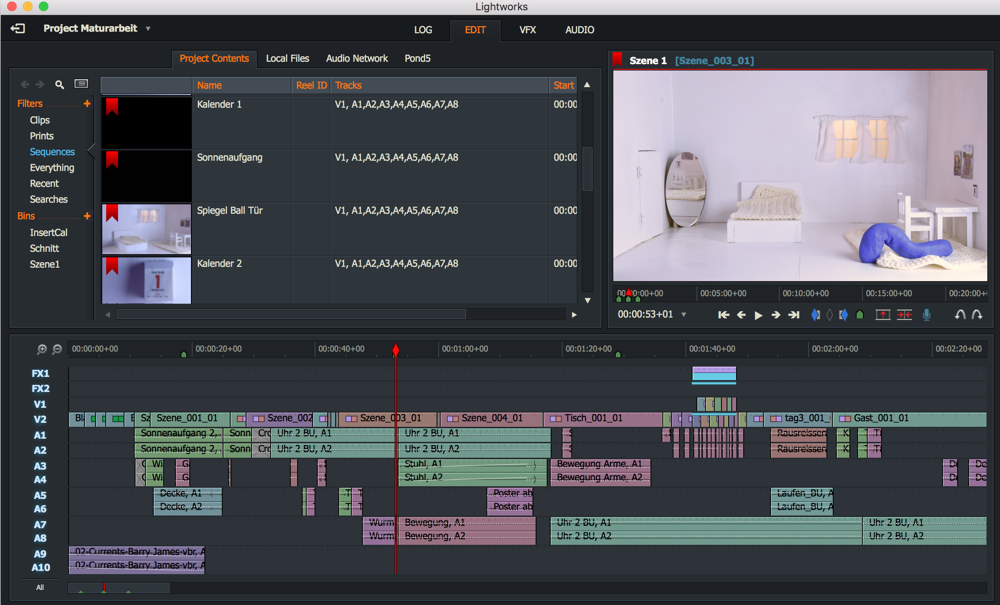

= Material und Methode

Ich teile dieses Kapitel in drei Themen ein, wie sie auch bei einer richtigen Filmproduktion stattfinden.
In der _Preproduction_ werden die Vorbereitungen für den Dreh gemacht.
Dazu gehören Drehbuch, Material, Technik und anders.

== Preproduction

=== Idee und Drehbuch

Wie in der Einleitung erwähnt, war es mir anfänglich sehr wichtig eine Arbeit mit einer Aussage zu machen.
Das behandelte Thema liegt oft in aller Munde, des öfteren wird es leider nicht ernstgenommen.
Weil es mir persönlich aber sehr wichtig ist ein ernstzunehmends Produkt herzustellten, war es wichtig meine Ideen gut umzusetzen und gegen Aussen verständlich zu machen.
Dafür brauchte ich ein Drehbuch.
Noch nie hatte ich zuvor ein Drehbuch geschrieben oder angeschaut, deshalb wusste ich nicht wirklich was ich machen soll.
In meinem Skizzenbuch hatte ich meine Ideen aufgeschrieben und aufgezeichnet.
Durch diesen Prozess kam ich zu einer klareren Vorstellung des Ablaufs meiner Geschichte.
Jedoch hatte ich anfänglich eine zu komplexe Idee.
Ich wollte mehrere Schauplätze herstellten und dadurch verschiedene Handelstränge einleiten.
Nach den ersten Filmsequenzen habe ich aber gemerkt, wie viel Arbeit es wirklich braucht.
Deshalb habe ich mich ziemlich schnell an der ersten Idee festgehalten und diese soweit ausgebaut, wie es mir möglich war.

.Anfängliche Idee

=== Storyboard

Wie in jedem Film, vor allem in animierten Filmen, braucht man für die konkrete Umsetzung von einer Idee zu einem Film ein Storyboard.
Man skizziert grob auf einem Blatt Papier eine Kameraeinstellung.
Die Perspektive und was auf dem spezifischen Bildausschnitt zu sehen ist wird festgelegt und die Handlung wird in einem kurzen Satz beschrieben.
Somit kann man verschiedene Aktionen aufzeichnen und nach Belieben die Sequenzen variieren.
Das Storyboard hilft eine langweilige Kameraführung zu vermeiden, indem die Abläufe der einzelnen Einstellungen der Kamera visualisiert werden.

.Drei Szenen aus dem Storyboard
image::images/storyboard.png[Storyboard, pdfwidth=100%,align=center]

.Die fertig gestalteten Szenen
image::images/storyboard_film.png[FertigeBilder, pdfwidth=100%,align=center]

=== Knetmasse

Um mich an die Arbeit heranzutasten, habe ich mich zuerst mit verschiedenen Modeliermassen auseinander gesetzt.
In allen Bastelläden, die ich besucht habe, wurde mir das Material _((Fimo))_ vorgeschlagen.
Bei der Arbeit damit stellte sich aber heraus, dass dieses Material sehr schnell brüchig und hart wird.
Dementsprechend war es für meine Arbeit nicht geeignet.

_((Plastilin))_ erwies sich schlussendlich als das passendste Material.
Um mich daran zu gewöhnen habe ich eine Zeit lang oft damit modelliert und verschiedene Objekte nachgebildet, um zu sehen was man mit Plastilin gestalten kann.
Es wurde mir schnell klar, dass Plastilin für vieles sehr passend ist.
Es lassen sich sowohl einfarbige, als auch mehrfarbige sowie gemischte Objekte herstellen.
Von dick zu dünn ist ziemlich alles möglich.
Ich habe Versuche gemacht, bei denen ich darauf geachtet habe verschiedene Oberflächen Strukturen nach zu bilden.
Das Material bietet viele Möglichkeiten, hat aber auch seine Grenzen.
So ist es nicht möglich, all zu filigrane Objekte zu modelieren, da Plastilin schnell instabil wird.
Dies bedingt zu Gunsten einer guten Standhaftigkeit einen genug dicken und schweren Fuss.
Ausserdem ist es schwierig Objekte herzustellen, die transparent, weich oder flüssig sind.
Ich habe mich herausgefordert ein Objekt herzustellen, welches aus verschiedenen Material und Strukturen besteht und damit an die Grenzen des Materials kommt.
Auf Abbildung 6 kann man meinen Versuch einer Nachbildung eines Feuers erkennen.
Es war nicht einfach die verschiedenen Farben einzusetzen und das Feuer lebendig erscheinen zu lassen.

.Erdnuss Nachbildung

.Feuer Nachbildung

=== Software

Ich erkannte, dass es zu zeitaufwenig und ungenauer wäre, einzelne Fotos zu schiessen und dann manuell nacheinander abspielen zu lassen.
Deshalb habe ich recherchiert, um herauszufinden, wie ich am besten meine Arbeit filmen kann.
Ich habe verschiedene Möglichkeiten ausprobiert und miteinander verglichen.

Die erste Technik, die ich angewendet habe war das heruntergeladene App "_StopMotion Studio_" auf meinem iPhone, welches man auf ein extra für Smartphones konstruiertes Stativ montiert.
Dies erwies sich jedoch als nicht sehr geeignet, denn die Qualität des Filmes war nicht überzeugend und unpraktisch zu bedienen, denn das iPhone auf dem Stativ war instabil.
Beim Bedienen des Auslösers hat sich das ganze Stativ verschoben und das resultierende Video wurde wackelig.

Danach habe ich auf dem Internet nach weiteren Stop-Motion Programmen recherchiert.
Zuerst habe ich mich auf günstige Programme konzentriert und mich für "_IStopMotion_" entschieden.
Nachdem ich das Programm gekauft hatte, stellte ich fest, dass es nicht mit meiner Kamera zusammen funktionierte. (TODO: anders Wort für zusammen funktionieren)
Deshalb musste ich es ebenfalls auf meinem SMartphone einsetzen und damit zeigten sich wiederum dieselben Probleme.

"_IStopMotion_" war aber auch sonst eine grosse Enttäuschung, denn es stürzte ständig ab.
Dadurch verlor ich einige Male gefilmte Sequenzen.
Zusätlich gab es keine Funktion zum manuellen Scharfstellen, was die Bildgestaltung sehr erschwerte.

Nach weiteren Recherchen bin ich dann auf das professionelle Animationsprogramm "((_Dragonframe_))" gestossen.
Ich habe die Testversion auf meinen Computer geladen und eine dazu passende Kamera, eine "((Nikon D7200))" von einer Familienfreundin organisiert.
Mit der Testversion habe ich kurze Ausschnitte gefilmt und das komplizierte Programm erlernt.
Da die Resultate endlich überzeugend waren und alles funktionierte, entschied ich mich, lieber Geld in ein gut funktionierendes Programm zu investieren, um nicht weitere Zeit zu verlieren.
Deshalb kaufte ich mir die Software und die dazu passende Steuerkonsole.

=== Bühnenbild

Der Grundriss meiner Bühne gleicht einem Puppenhaus.
Zuerst baute ich einen offenen Raum aus Sperrholz.
Ich habe mich für die Einrichtung eines Schlafzimmers entschieden, damit ich einen einheitlichen Raum zur Verfügung hatte, der nicht nach jedem Filmprozess neu gestaltet oder umgebaut werden musste.
Das Puppenhaus ähnliche Schlafzimmer hat sich als sehr praktisch herausgestellt, denn ich konnte das ganze Zimmer verschieben und somit Perspektiven erzeugen, die allein mit der Verschiebung der Kamera nicht machbar gewesen wären.
Ausgestattet habe ich diesen Raum mit selber gemachten Möbeln und Dekorationen.

.Bühnenbau Skizze

== Production

=== Beleuchtung

Bei der Beleuchtung der Szene habe ich mich ziemlich eingegrenzt.
Ich habe mich auf eine Filmgrundlage gestützt.
Die Dreipunkt Beleuchtung benutzt man oft, um eine ganze Szene zu beleuchten und verschiedene Teile zu fokusieren. (TODO: Ausführen)

.Beleuchtung

=== Film und Fotografie

Dank Barabara Burri, einer Bekannten, war es mir möglich mit einer professionellen Spiegelreflex Kamera, einer Nikon D7200 und einem xy Objektiv arbeiten zu können.
Die hohe Qualität meines Films wurde durch diese Kamera ermöglicht.
Ausserdem wurde die Kamera von dem oben erwähnten, professionellen, auf Animationen spezialisiertem Programm _"Dragonframe"_ unterstützt.
Gemäss Hurni <<hurni>> ist es bei der Bildkomposition wichtig, die Drittelregel anzuwenden.
Dabei wird das Bild mit vier Linien (zwei Horizontalen und zwei Vertikalen) in neun gleichgrosse Rechtecke unterteilt.
Die Schnittpunkte der Linien benutzt man um das Motiv zu positionieren.
Man versucht das Motiv auf einen der Schnittpunkte zu platzieren.
Dies gefällt dem menschlichen Auge, vermutlich weil die vier Schnittpunkte von den Proportionen her, dem Goldenen Schnitt ähneln.

Durch das Verwenden des Teleobjektiv war es mir möglich sowohl Nahaufnahmen, als auch die Totale zu verwenden, um unterschiedliche Bildausschnitte zu zeigen.

Mit der Tiefenschärfe kann man im Film die Aufmerksamkeit des Betrachters leiten.
Ich habe in meinem Film bewusst versucht, dieses Mittel der Gestaltung zu nutzen.
In der unten gezeigten Szene kann man sehen, wie sich Schärfe verändert während die Figur den Raum betritt.
Angekommen beim Spiegel, am eigentlichen Ort der Handlung, ist die Kamera so eingestellt, dass das Spiegelbild scharf ist und somit die Bewegungen der Figur gut erkennbar sind.

.Veränderung der Tiefenschärfe innerhalb einer Szene
image::images/tiefenschaerfe.png[Tiefenschärfe, pdfwidth=100%,align=center]

=== Ton

Gleichzeitig habe ich mit einem "((Zoom H5))"-Fieldrecorder Geräusche in meinem Haus aufgenommen, die passend zu den aufgenommenen Szenen waren.
Viele der Geräusche habe ich aus ähnlichen Tätigkeiten, wie die im Film gezeigten, aufgenommen, um es so authentisch wie möglich darzustellen.
Beispielsweise habe ich für das Abreissen des Kalender ein normales Kopierpapier zerissen oder für den Ton der schliessenden Türe, habe ich das quietschen meiner Kleiderschranktüre aufgenommen.
Es war ein interessanter und kreativer Prozess, diese einzelnen Szenen zu vertonen.
Diese einzelnen habe ich als Clips in "Lightworks" importiert und an passender Stelle platziert.
Hie und da mussten gewisse Tonaufnahmen bearbeitet oder gekürzt werden.
Weil ich die Videoaufnahmen jeweils mit 50% Schnelligkeit im Schnittprogramm laufen liess, konnte ich erst nach der Verlangsamung die jeweilig passende Tonspur aufnehmen.
Ansonsten hätte sich bei der nachträglichen Bearbeitung die Tonspur in ihrer Tonhöhe unterschieden.

== Postproduction

Nach dem die etwa 3000 Fotos auf Festplatte gebannt waren, ging es im folgenden Schritt darum, aus diesem Rohmaterial einen Film zu machen.
Am Anfang dachte ich, dass es sich dabei nur um das Schneiden von Filmsequenzen handelt, aber es waren noch weitere Schritte nötig, um ein fertiges Produkt zu erhalten.

=== Schnitt

Nach dem fotografieren einer Szene habe ich die noch einzelnen Fotos als Video exportiert und in das Schnittprogramm _(((Lightworks)))_ eingefügt.
Dort habe ich stetig die Sequenzen hintereinander eingefügt und erhielt somit einen groben Verlaufsstrang.
Weiter hinzu kamen die Übergänge.
Mir persönlich gefallen die Überblendungen am besten.
Sie scheinen für mich am simpelsten und am natürlichsten fürs Auge.
Den Vorspann und Abspann habe ich direkt in Lightworks in den vorhandenen Film eingefügt und mit verschiedenen Effekten bearbeitet. (TODO: Spuren satz)

.Zeitachse in Lightworks

=== Farbkorrektur

Ganz am Schluss meiner Arbeit musste ich noch die Farben im Film anpassen, weil die Unterschiede der verschiedenen Lichtereignisse zu gross waren.
(TODO: Farbtemperatur)
Nach Recherche und Versuchen habe ich selber herausgefunden, wie man die Farben im "Lightworks" korrigieren kann.
Diese Arbeit ist nicht sehr einfach und basiert auf der indivuduellen Wahrnehmung und dem Geschmack.
Ich habe im allgemeinen versucht meinen Film wärmer zu kolorieren, denn die originalen Aufnahmen hatten einen starken Blaustich.
Ausserdem habe ich versucht, die Veränderungen von beispielsweise der Morgenszene und der darauf folgenden Szene zu minimieren.

.Beispiel einer Farbkorrektur. Links Original, rechts korrigiertes Bild

=== Musik

Die Musik, die ich für meinen Vorspann und Abspann gewählt habe, habe ich aus einer Webseite "_Magnatunes_" (TODO: Glossar) für lizenzfreie Musik genommen.
Mir war es wichtig mit der Musik ein Spannungsgefüge aufzubauen.
Zu Beginn scheint die Gitarrenbegleitung eher einfach und simpel und gegen Ende wird sie dann aufregender und wirkt fröhlicher. (TODO. Warum diese Musik?)
