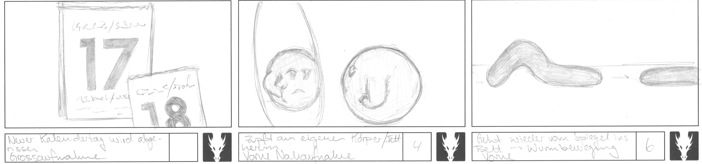
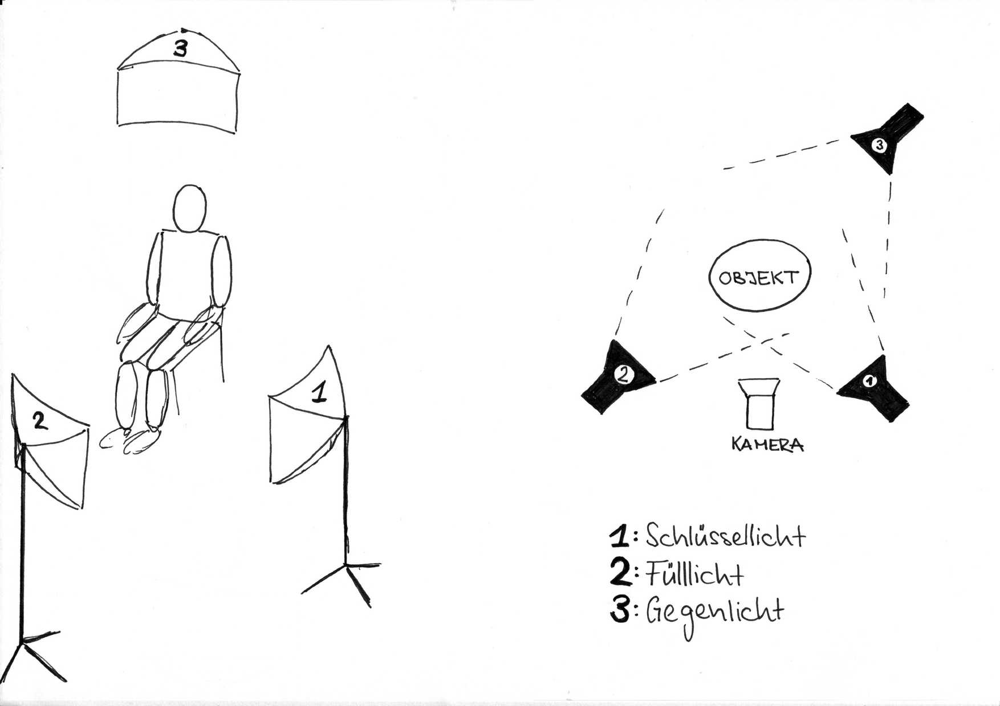
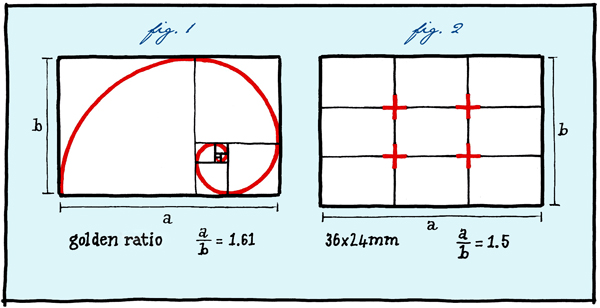

= Material und Methode

Ich teile dieses Kapitel in drei Unterkapitel ein, wie sie auch als Phasen bei einer richtigen Filmproduktion stattfinden.
In der _Preproduction_ werden die Vorbereitungen für den Dreh gemacht.
Dazu gehören Drehbuch, Material, Technik und anderes mehr.
In der _Production_ wird Film und Ton aufgenommen und in der _Postproduction_ entsteht das fertige Produkt.

== Preproduction

=== Idee und Drehbuch

Wie in der Einleitung erwähnt, war es mir anfänglich sehr wichtig, eine Arbeit mit einer Aussage zu machen.
Das behandelte Thema ist oft in aller Munde, aber es wird oft nicht ernstgenommen.
Weil es mir persönlich aber ein Anliegen ist, ein ernstzunehmends Produkt herzustellen, war es wichtig, meine Ideen gut umzusetzen und verständlich zu machen.

Dafür brauchte ich ein Drehbuch.
Ich hatte noch nie zuvor ein Drehbuch geschrieben oder angeschaut, deshalb wusste ich nicht wirklich, wie ich das angehen sollte.
In meinem Skizzenbuch hatte ich meine Ideen aufgeschrieben und aufgezeichnet.
Durch diesen Prozess kam ich zu einer klareren Vorstellung des Ablaufs meiner Geschichte.
Jedoch hatte ich anfänglich eine zu komplexe Idee, denn ich wollte mehrere Schauplätze herstellen und dadurch verschiedene Handelstränge einleiten.
Nach den ersten Filmsequenzen habe ich aber gemerkt, wie viel Arbeit es wirklich braucht, um dies zu realisieren.
Deshalb blieb ich bei meiner ersten Idee und habe diese soweit ausgebaut, wie es mir möglich war.

In Abbildung 2 ist ein Ausschnitt aus meinem Skizzenbuch zu sehen, in welchem man einen Teil der Handlung der ersten Idee sieht.

.Anfängliche Idee
image::images/drehbuch_ideen.png[Drehbuch Ideen, pdfwidth=40%,align=center]

=== Storyboard

In jedem Film braucht man für die konkrete Umsetzung einer Idee zu einem Film ein Storyboard.
Dort skizziert man grob auf einem Blatt Papier jede Szene und Kameraeinstellung.
Die Perspektive und was auf dem spezifischen Bildausschnitt zu sehen ist, wird festgelegt und die Handlung in einem kurzen Satz beschrieben.
Damit kann man eine Szene in verschiedenen Variationen ausprobieren.
Das hilft, den Film mit wenig Aufwand vorab zu gestalten und zu visualisieren.

.Drei Szenen aus dem Storyboard

.Die fertig gestalteten Szenen

=== Knetmasse

Um mich an die Arbeit heranzutasten, habe ich mich mit zwei verschiedenen Modeliermassen auseinander gesetzt.
In allen Bastelläden, die ich besucht habe, wurde mir das Material _Fimo_ vorgeschlagen.
Bei der Arbeit damit stellte sich aber heraus, dass dieses Material sehr schnell brüchig und hart wird.
Deshalb war es für meine Arbeit nicht geeignet.

Schlussendlich erwies sich _Plastilin_ als das beste Material.
Um mich daran zu gewöhnen, habe ich eine Zeit lang oft damit modelliert und verschiedene Objekte nachgebildet, um zu sehen, was man mit Plastilin gestalten kann.
Es wurde mir schnell klar, dass Plastilin für Vieles sehr passend ist.
Es lassen sich einfarbige, mehrfarbige und gemischte Objekte herstellen.
Ich habe Versuche gemacht, bei denen ich darauf geachtet habe, die Struktur verschiedener Oberflächen nachzubilden.
Das Material bietet viele Möglichkeiten, hat aber auch seine Grenzen.
So ist es nicht möglich, allzu filigrane Objekte zu modellieren, da Plastilin schnell instabil wird.
Bedingung für eine gute Standhaftigkeit ist eine genug dicke und schwere Basis.
Ausserdem ist es schwierig Objekte herzustellen, die transparent, weich oder flüssig sind.
Um Plastilin besser kennenzulernen, habe ich mich damit herausgefordert ein Objekt herzustellen, welches aus verschiedenen Materialien und Strukturen besteht und damit an die Grenzen der Möglichkeiten der Knetmasse kommt.

Auf Abbildung 5 sieht man meinen Versuch eine Erdnuss zu modellieren.
Ich habe mir bewusst die schwierige Aufgabe gestellt, eine aufgebrochene Schale mit innenliegender Nuss zu zeigen, um zu sehen wie sich das Material verhält und bearbeiten lässt.
Daneben ist mein Versuch ein Feuer nachzubilden.
Es war nicht einfach, die verschiedenen Farben einzusetzen und das Feuer lebendig erscheinen zu lassen.

.Erdnuss und Feuer Nachbildung
image::images/erdnuss_feuer.png[Erdnuss Nachbildung, pdfwidth=67%,align=center]

=== Software

Ich erkannte frühzeitig, dass es zu zeitaufwändig und ungenau ist, einzelne Fotos zu schiessen und diese dann manuell nacheinander abzuspielen.
Deshalb habe ich recherchiert, um herauszufinden, wie ich meine Arbeit am besten filmen kann.
Ich habe verschiedene Möglichkeiten ausprobiert und miteinander verglichen.

Der erste Versuch war mit der App _StopMotion Studio_ auf meinem iPhone.
Das Telefon wurde dabei auf ein extra für Smartphones konstruiertes Stativ montiert.
Das Resultat war nicht befriedigend, denn einerseits war die Qualität der Bilder nicht besonders gut, andererseits war die Handhabung sehr unpraktisch.
Um ein Bild zu machen, musste ich auf dem Bildschirm des Telefons einen Knopf drücken.
Dabei verschob sich der ganze Aufbau und das Resultat war ein unruhiges und verwackeltes Video.

Danach habe ich auf dem Internet nach weiteren Stop-Motion Programmen gesucht.
Zuerst habe ich mich auf günstige Programme konzentriert und mich für _IStopMotion_ entschieden.
Nachdem ich das Programm gekauft hatte, stellte ich fest, dass ich meine Kamera nicht mit der Software koppeln konnte.
Deshalb musste ich es ebenfalls auf meinem Smartphone einsetzen und damit ergaben sich wieder dieselben Probleme wie oben beschrieben.

_IStopMotion_ war aber auch sonst eine grosse Enttäuschung, denn das Programm stürzte ständig ab und ich verlor einige Male gefilmte Sequenzen.
Zusätzlich gab es keine Funktion zum manuellen Scharfstellen, was die Bildgestaltung sehr erschwerte.

Nach weiteren Recherchen bin ich dann auf das professionelle Animationsprogramm _Dragonframe_ gestossen.
Ich habe die Testversion auf meinen Computer geladen und eine dazu passende Kamera, eine _Nikon D7200_, von einer Familienfreundin ausgeliehen.
Mit der Testversion habe ich kurze Ausschnitte gefilmt und das komplizierte Programm erlernt.
Da die Resultate endlich überzeugten und alles funktionierte, entschied ich mich, lieber Geld in ein gut funktionierendes Programm zu investieren und keine weitere Zeit zu verlieren.
So kaufte ich mir die Software und die dazu passende Steuerkonsole.

=== Bühnenbild

Der Grundriss meiner Bühne gleicht einem Puppenhaus.
Zuerst baute ich einen offenen Raum aus Sperrholz.
Ich entschied mich für die Einrichtung eines Schlafzimmers, damit ich einen einheitlichen Raum zur Verfügung hatte, der nicht nach jedem Filmprozess neu gestaltet oder umgebaut werden musste.
Ausgestattet habe ich diesen Raum mit selber gemachten Möbeln und Dekorationen.
Die Konstruktion hat sich als sehr praktisch herausgestellt, denn ich konnte das ganze Zimmer verschieben und somit Perspektiven erzeugen, die allein mit der Verschiebung der Kamera nicht machbar gewesen wären.

.Konstruktionsskizze
image::images/szenenbau.png[Szenenbau Skizze,pdfwidth=50%,align=center]

== Production

=== Beleuchtung

Bei der Wahl der Beleuchtung der Szene, habe ich mich ziemlich eingegrenzt und nur eine Variante verwendet.
Es handelt sich um die sogennante _Dreipunkt Beleuchtung_ wie in <<negenborn>> beschrieben.
Man arbeitet mit drei Lichtquellen, um Szene und Objekt zu beleuchten.
Das _Schlüssellicht_ ist das Hauptlicht und beleuchtet das Objekt meist von vorne.
Mit dem _Fülllicht_ werden Schatten, die vom Schlüssellicht erzeugt werden aufgehellt.
Schliesslich verwendet man ein _Gegenlicht_, um Silhoutten und Konturen hervorzuheben und das Objekt damit klar zu definieren.

.Skizze Dreipunkt Beleuchtung

=== Film und Fotografie

Dank Barabara Burri, einer Bekannten, war es mir möglich mit einer professionellen Spiegelreflexkamera, einer _Nikon D7200_ und einem 16-300mm Objektiv zu arbeiten.
Daraus ergab sich die gute Filmqualität meines Films.
Ausserdem wurde die Kamera von dem oben erwähnten Programm _Dragonframe_ unterstützt.

Gemäss Hurni <<hurni>> ist es bei der Bildkomposition wichtig, die Drittelregel anzuwenden.
Dabei wird das Bild mit vier Linien (zwei Horizontalen und zwei Vertikalen) in neun gleichgrosse Rechtecke unterteilt.
Die Schnittpunkte der Linien benutzt man, um das Motiv zu positionieren.
Man versucht das Motiv auf einen der Schnittpunkte zu platzieren.
Dies gefällt dem menschlichen Auge, weil die vier Schnittpunkte von den Proportionen her, dem Goldenen Schnitt ähneln.

.Drittelregel

In der Abbildung 8 von <<asingulareye>> ist der Vergleich der beiden Verhältnisse gut zu sehen.

Durch das Verwenden des Teleobjektivs war es mir möglich, sowohl Nahaufnahmen als auch die Totale zu verwenden, um unterschiedliche Bildausschnitte zu zeigen.

Die Tiefenschärfe bezeichnet den Bereich im Bild (die Tiefe), die Scharf gestellt wird.
Mit ihr kann man im Film die Aufmerksamkeit des Betrachters lenken.
Ich habe in meinem Film bewusst versucht, dieses Mittel der Gestaltung zu nutzen.
In der unten gezeigten Szene kann man sehen, wie sich Schärfe verändert während die Figur den Raum betritt.
Angekommen beim Spiegel, am eigentlichen Ort der Handlung, ist die Kamera so eingestellt, dass das Spiegelbild scharf ist und somit die Bewegungen der Figur gut erkennbar sind.

.Veränderung der Tiefenschärfe innerhalb einer Szene

=== Animation

Der wohl wichtigste Produktionsschritt meiner Arbeit ist die effektive Animation.
_Animation_ ist der Oberbegriff für Techniken, bei denen durch das Erstellen und Wiedergeben von Einzelbildern der Eindruck eines bewegten Bildes entsteht.
Das können zum Beispiel gezeichnete Bilder, von Computer erstellte oder fotografierte Aufnahmen sein.
Ich habe mich für das Letztere entschieden.

Nachdem ich eine Szene aufgebaut hatte, habe ich diese fotografiert.
Bevor ich das nächste Bild gemacht habe, musste ich die Figuren bewegen oder neu formen.
Spielt man diese Bilder schnell hintereinander ab, entsteht für den Betrachter ein Film.
Ein normaler Kinofilm wird mit 24 Bildern pro Sekunde gefilmt.
Für das Auge ist die schnelle Abfolge der Bilder als Film wahrnehmbar.
In meinem Animationsfilm arbeite ich mit 12 Bildern pro Sekunde.
Beim Abspielen wird jedes Bild zwei Mal gezeigt, damit wieder eine Geschwindigkeit von 24 Bildern pro Sekunde entsteht.

=== Ton

Um einen Film glaubwürdig zu machen, braucht es neben dem Bild auch Ton in der Form von Sprache, Musik, Toneffekten und Geräuschen.
Diese bringen das Bild erst zum Leben.
In diesem Film habe ich bewusst auf Sprache verzichtet und mich auf Toneffekte konzentriert.
Im Englischen nennt man diese Arbeit _Foley Art_.

Mit einem _Zoom H5-Fieldrecorder_ habe ich Geräusche in unserem Haus aufgenommen, die zu den aufgenommenen Szenen passten.
Viele der Geräusche habe ich aus ähnlichen Tätigkeiten, wie die im Film gezeigten, aufgenommen, um sie so authentisch wie möglich darzustellen.
Beispielsweise habe ich für das Abreissen des Kalender ein normales Kopierpapier zerissen oder für den Ton der schliessenden Türe, habe ich das Quietschen meiner Kleiderschranktüre aufgenommen. Die einzelnen Szenen zu vertonen war ein interessanter und kreativer Prozess.
Die Tonaufnahmen habe ich als Dateien in das Schnittprogramm _Lightworks_ importiert und synchron zum Bild platziert.

== Postproduction

Nach dem die etwa 3000 Fotos auf Festplatte gespeichert waren, ging es im folgenden Schritt darum, aus diesem Rohmaterial einen Film zu machen.
Am Anfang dachte ich, dass es sich dabei nur um das Schneiden von Filmsequenzen handelt, aber es waren noch weitere Schritte nötig, um ein fertiges Produkt zu erhalten.

=== Schnitt

Nach dem Fotografieren einer Szene habe ich die einzelnen Fotos als Video exportiert und in das Schnittprogramm _Lightworks_ eingefügt.
Dort habe ich die Sequenzen hintereinander eingesetzt und erhielt damit einen ersten, groben Rohschnitt.
Diesen Rohschnitt musste ich bearbeiten, indem ich zum Beispiel den Zeitpunkt von Anfang oder Ende einer Sequenz auf 12tel Sekunden genau bestimmte.
Danach musste ich teilweise Übergänge zwischen den Sequenzen einfügen.
Das waren zum Beispiel Überblendungen oder Ein-/Ausblenden.

In Abbildung 10 sieht man das ganze Projekt im Schnittprogramm.
Insgesamt waren zwei Video-, zwei Effekt- und zehn Audiospuren für die Montage nötig.

.Bearbeitung in Lightworks
image::images/Spuren.lwks.png[Zeitachse in Lightworks, pdfwidth=100%,align=center]

=== Farbkorrektur

Ganz am Schluss musste ich noch die Farben im Film anpassen, weil die Farben gleicher Elemente von Szene zu Szene sehr unterschiedlich waren.
Nach Recherche und Versuchen habe ich herausgefunden, wie man die Farben im _Lightworks_ korrigieren kann.
Diese Arbeit ist komplex und basiert auf der individuellen Wahrnehmung und dem eigenen Geschmack.
Ich habe im Allgemeinen versucht meinen Film wärmer zu kolorieren, denn die Orginalaufnahmen hatten einen starken Blaustich.

In der Abbildung 11 ist links das originale Bild und rechts die korrigierte Version zu sehen.
Links unten sieht man, mit welcher Intensität die drei Grundfarben (Rot, Grün, Blau) in der Szene vorkommen.
Es ist deutlich zu sehen, dass das Bild einen Blaustich hat, denn im Diagramm ist das Blau auf der Y-Achse weiter oben.
Durch Korrektur mit den drei Farbrädern oben links konnte ich die drei Farbkomponenten ausgleichen.

.Beispiel einer Farbkorrektur
image::images/farbkorrektur.png[Farbkorrektur, pdfwidth=100%,align=center]

=== Musik

Die Musik, die ich für Vorspann und Abspann gewählt habe, habe ich von der Webseite _Magnatune_ genommen.
Die Musik ist unter einer _Creative Commons_ Lizenz verfügbar, die es erlaubt, sie zum Beispiel in nicht-kommerziellen Filmen zu verwenden.

Ich habe lange nach der passenden Musik gesucht.
Mir war es wichtig, dass die Musik instrumental ist und dem Film entspricht.
Zusätzlich sollte sie den verschiedenen Stimmungen zu Beginn und Ende des Films entsprechen und diese verstärken.
