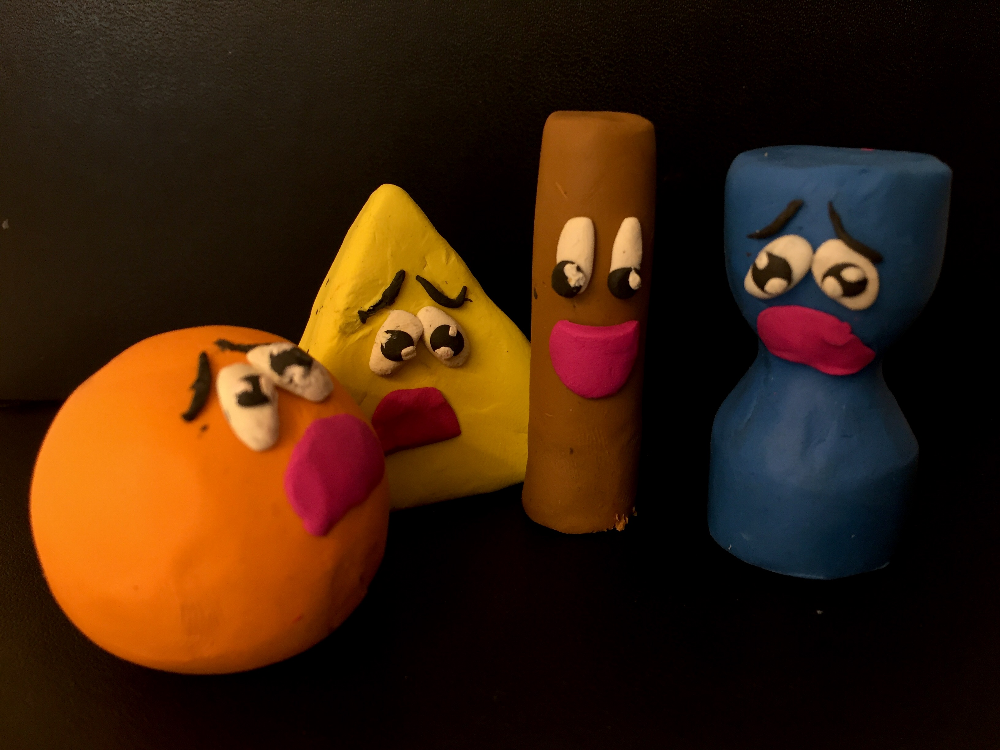

= Analyse

In meinem Film habe ich bewusst verschiedene, einfache Objekte verwendet, um das gewählte Thema zu beleuchten.
Im folgenden Kapitel habe ich die wichtigsten Gegenstände erklärt.

== Bühnenbild

Das Schlafzimmer ist für mich ein intimer Ort, in dem sich die Persönlichkeit des Bewohners spiegelt.
Ausserdem kann das Schlafzimmer als ein Ort der Konfrontation mit sich selbst dienen.
Schliesslich ist es ein Ort für Routinevorgänge.
Tag für Tag kriecht man Morgens mühselig aus dem Bett und kommt Abends wieder am selben Ort zur Ruhe.
Diesen Vorgang habe ich in meinem Kurzfilm dargestellt.
Das Betrachten des Ebenbilds stellt Spiegel im Film ebenfalls eine tägliche Routine dar.

Die Farbe der Ausstattung habe ich ganz bewusst in Weiss umgesetzt.
Einerseits habe ich diese Farbe benutzt, um die Hauptfigur in den Fokus zu setzen.
Andererseits habe ich verschiedene Bedeutungen der Farbe Weiss recherchiert und fand einiges in der Symbolik passend für mein Projekt.
Zum Beispiel schreibt viversum <<viversum>> in ihrem Text zur Spiritualität:

[quote]
--
"Sie steht für den Winter, für Eis und Schnee, sie gibt uns Kraft bei der Lösung unserer Probleme und wirkt unheimlich beruhigend: die Farbe Weiß.

Reinheit, Frische, Unschuld – die Farbe Weiß weckt viele Assoziationen in uns.

Doch Weiß ist noch so viel mehr als eine Farbe: In fernöstlichen Kulturen wie China oder Japan steht sie für Trauer und Tod, in der katholischen Kirche im Gegenteil für das Licht der Erleuchtung, das alles Sichtbare hervorbringt.

Sie festigt uns innerlich und befreit uns von störenden Gedanken."
--

Der weisse Raum, der ruhig und frei von Ablenkungen ist. Der Raum, in dem sich die Hauptperson von ihren störenden Gedanken und Problemen entfernt und sich von ihrer Trauer befreit.

Mit Fortschreiten des Projekts sind auf Boden und Wänden des Raums Rückstände der Knetfiguren und damit der Handlung sichtbar geworden.
Jede Szene, die ich gespielt und gefilmt habe, hat Spuren von farbiger Knetmasse im Raum hinterlassen.
Damit wird der Ausdruck _Man hinterlässt überall seine Spuren_ ganz konkret sichtbar.

== Hauptfigur

Die Knetmasse soll einen nicht näher definierten Menschen darstellen.
Es ist egal welche Hautfarbe, welchen Körperbau oder welches Geschlecht -- die Figur soll das "DU" sein.
Ob man sich auf dieses Bild einlassen will und sich mit dieser Figur oder Masse identifiziert, bleibt dem Betrachter selber überlassen.
Die Figur soll einfach eine Projektionsfläche bieten, auf welcher sich der Zuschauer finden und sich seine persönliche Geschichte ausmalen kann.
Zentral ist, dass die Figur ständig ihre Körperform wechselt und dennoch unzufrieden bleibt.
Damit will ich aufzeigen, dass nicht die Veränderung des Körperbilds Zufriedenheit gibt, sondern dass diese zuerst in Kopf und Gedanken stattfinden muss.

Das Material _Plastilin_ hat sich für diesen Zweck sehr bewährt, denn das Material ist sehr gut verformbar und wird auch nach langer Zeit nicht spröde.
Man kann es deshalb gut über mehrere Tage oder Wochen stehen lassen.
Dies erwies sich als sehr praktisch, denn ich konnte mit einer einzigen Masse arbeiten und musste nicht bei jedem Filmversuch eine neue Form mit neuer Knetmasse herstellen.
Die Figur hatte also über die ganze Zeit der Dreharbeit den gleichen Körper, der sich veränderte.
Ausserdem hat Plastilin eine der menschlichen Haut ähnliche Oberflächenbeschaffenheit, was das Modellieren einfacher gestaltete.
Die Handlung konnte mit der Wahl dieses Materials sehr gut umgesetzt werden.

Die Farbe Blau habe ich gewählt, weil sie für mich etwas kaltes und trauriges ausstrahlt.
Zudem vermeide ich den Bezug zu einer menschlichen Hautfarbe.
Deshalb entsteht ein von einem spezifischen Menschen unabhängiges Individuum.

Die Figur ist ein von aussen beeinflusstes Wesen.
Gut erkennbar sind die Auswirkungen der Einflüsse, bei der Szene in der die Figur die Poster betrachtet und dann wegwirft.
Nach dem Anschauen der "perfekten" Figuren fühlt sich die Hauptfigur traurig und unzufrieden.
Diese Situation soll das wirkliche Leben widerspiegeln.
Wie in der Einleitung erklärt, befasse ich mich persönlich ständig mit diesem Thema und kenne diese Situation nur all zu gut.
Deshalb war es mir wichtig, sie in meinem Film aufzunehmen und zu thematisieren.

.Erster Versuch die Hauptfiguren zu modellieren

Die Figuren in Abbildung 12 enstanden während der Ideenentwicklung.
Ich wollte verschiedene Körperformen zeigen und habe sie durch geometrische Grundformen abstrahiert.
Ich dachte zuerst, dass ich zum Zeigen von Emotionen Augen, Augenbrauen und Mund benötige.
Es stellte sich jedoch heraus, dass diese Hilfsmittel gar nicht nötig waren, um die Gefühle auszudrücken.
Ausserdem wollte ich mich von den Emoji ähnlichen Figuren entfernen.

== Zweite Figur

Die zweite Figur tritt zur Unterstützung auf.
Sie soll die Hauptfigur dazu ermuntern, sich selber zu akzeptieren und zu realisieren, dass alles an ihr gut ist.
Ein wichtiger Aspekt für die Aussage der Handlung ist, dass die beiden Figuren beim ersten Treffen einen identischen Körperbau besitzen -- nämlich den einer Kugel.

Der grundlegende Unterschied ist der Gemütszustand der beiden.
Die grüne Figur ist, trotz der gleichen Statur, vollkommen zufrieden und im Einklang mit sich selbst und kann sich erfreut im Spiegel ansehen.
Die blaue Kugel hingegen ist alles andere als zufrieden.
Die Umarmung der Beiden ist der Auslöser für die Besserung.
Es ist ein Austausch an Emotionen und Unterstützung.
Wenn man genau Acht gibt, kann man erkennen, dass nach der Umarmung der beiden, Rückstände der grünen Figur am Körper der blauen Figur hängen bleiben.
Dies macht diesen Austausch deutlich und zeigt auf, dass sie jetzt nach der Umarmung und der weitergegebenen Vernunft, zufrieden sein und sich selber, so wie sie ist, akzeptieren kann.

== Kalender

Der Kalender ist ebenfalls ein wichtiges Objekt in meinem Film.
Er kommt immer wieder vor, hat aber keine wirklichen Beziehung zur Figur oder Handlung.
Das Abreissen der Tage soll die Zeitspanne der Handlung zeigen und ausserdem den Zuschauer durch den langen Prozess der Unzufriedenheit begleiten.
Über dem Pult, unter den Postern kann man auch einen kleinen Kalender erkennen.
Dieser soll die Brücke zwischen dem effektiven Kalender und dessen Sequenzen und der sonstigen Handlung schlagen.
Im Abspann wird der Kalender wieder aufgegriffen.
Man erkennt das Schlafzimmer in der Totalen und die sich darin immer mehr sammelnden abgerissenen Kalenderblätter.
Die Dauer der Handlung wird so noch einmal aufgenommen und betont.

== Spiegel

Schliesslich noch das titelgebende Element, der Spiegel.
Anders als im Märchen, wo der Spiegel die Schönheit der Betrachterin bestätigt, ist dieser Spiegel stumm.
Eigentlich reflektiert der Spiegel nur genau das, was vor ihm steht.
Der Betrachter filtert dieses Bild jedoch durch seine eigene Wahrnehmung und seine eigenen Vorstellungen.
Der zweite Betrachter schenkt der ersten Figur eine neue Perspektive, die es ihr erlaubt, die Schönheit, die ihr der Spiegel zeigt, zu erkennen. 
